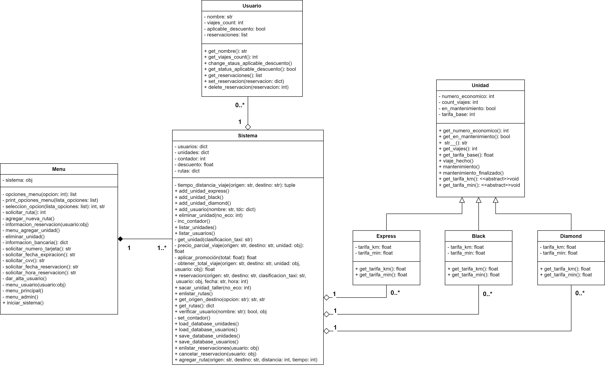

[](https://classroom.github.com/a/XixB-tii)
[](https://classroom.github.com/open-in-codespaces?assignment_repo_id=12231393)

# Proyecto

## Diagrama UML



## Analisis del Problema

### Puntos Importantes del Antecedente

- Para establecer un sistema de taxis se requieren de tres tipos de unidades diferentes: express, black y diamond. Sin importar el tipo de unidad se toma en cuenta una tarifa base y para identificar a las diferentes unidades tenemos un número económico único para cada una. Además los diferentes tipos de unidad ofrecen los siguiente:
  - La tarifa que cobre cada unidad dependerá de la comodidad de la misma, siendo la unidad diamond la mas comoda por ende con una tarifa más alta y en contraparte la unidad express es la más compacta por lo tanto su tarifa es economica, y la unidad black se encontraba en un punto medio de ambas unidades.
- El sistema de taxis que gestiona las reservaciones hechas por los usuarios deberá de cumplir con lo siguiente:
  - Al momento de darse de alta, el usuario tendrá que proporcionar su nombre y los datos de su tarjeta de crédito
  - El usuario podrá acceder a promociones y descuento únicos si ha hecho reservaciones al menos 5 veces en el lapso de una semana
- Para las reservaciones se espera que dependan de:
  - El cliente que haga la reservación
  - El origen y destino marcado por el cliente
  - La fecha y hora del viaje
  - Y el tipo de unidad que se solicite
- Para las unidades de vez en cuando, será necesario llevarlas al taller para realizar labores de mantenimiento, lo que significa que durante ese período no estarán a disposición.

### Consideraciones tomadas

- Para que el usuario pueda hacer una reservación en el sistema, deberá de estar dado de alta en el mismo sistema, de lo contrario deberá comunicarse con el administrador para poder ser dado de alta.
- Las unidades que entren a taller por mantenimiento y el administrador es responsable de sacarlo del taller.
- Para las rutas se reestrige poniendo como punto comun que sean para los alumnos de la UAM-C.
- Tomamos a consideracion la necesidad de un administrador para llevar el control sobre las unidades (eliminar unidad, agregar, sacar del taller), de los usuarios (dar de alta usuario).

### Abstraccion

- En el mundo fisico cuando se trata de un sistema de taxis nos encontramos con un sistema que lo maneje el cual fue descrito en el antecedente, además el sistema interactúa con las unidades y los usuarios.

- En el mundo real es usual encontrar en aplicaciones dedicadas a dar servicio de taxi con la posibilidad de escoger entre diferentes tipos, las características que definen a las diferentes unidades de estas aplicaciones son en su precio que dependen de la comodidad de cada unidad. Para nuestro problema se identifican tres unidades diferentes con esta característica dependiente del precio.

- Los automóviles dedicados a dar servicio de taxi debido al constante desgaste de las unidades exigida por esta actividad es necesario que regularmente estas unidades sean llevadas a mantenimiento por su desgaste continuo,  por consiguiente en este proceso una unidad no puede brindar su servicio.

- El sistema de taxis se convierte en una abstracción de un objeto que sea capaz de gestionar las reservaciones que hagan los clientes, así como gestionar la base de datos de sus unidades y los clientes. Además este sistema lleva un registro de las rutas establecidas.

- Las operaciones realizadas por el sistema son acciones comunes para un objeto de este tipo. La abstracción de estas acciones permiten una interacción eficiente con las unidades y los usuarios.

- Una forma común en que un usuario interactúa con una aplicación de este tipo es mediante una interfaz que facilita la relación entre el usuario y el sistema. Esta abstracción es fundamental ya que es un método práctico por el cual un usuario puede comunicarse con el sistema y hacer uso de las funciones que se le ofrezcan.

- Una persona como un usuario de un sistema que ofrezca algún servicio, se tiene que registrar o dar de alta y en caso de ser necesario deberá de otorgar su información bancaria como método de pago. Esto es importante ya que el sistema no permite sus uso hacia las personas que no estén registradas otorgando seguridad a quien ocupe el sistema.

### Diseno propuesto

Teniendo en cuenta los puntos anteriores se propone el siguiente diseno

- Para la unidad
  
  - Es conveniente tratar a las unidades de un sistema de taxis como una clase ‘padre’ que dentro de sus atributos almacene características que no dependen del tipo de unidad, por lo tanto son características y comportamientos comunes entre las diferentes unidades.

- Para las diferentes unidades
  - La idea a seguir para representar cada unidad es mediante una herencia de Unidad, esto las convierte en “hijas” de la clase video ya que comparten atributos y métodos comunes pero también cada tipo de unidad maneja atributos específicos

- Para los usuarios
  - Para el sistema es importante que se tenga un registro del usuario con información básica (nombre, datos bancarios) e información como la reservación para otorgar alguna promoción si es elegible a ella

- Para el sistema de taxis
  - Este sistema interactúa con las diferentes unidades y usuarios, lleva un control sobre la lógica para el inventario de las unidades como de los usuarios dados de alta. La idea general de este sistema es que sea la única instancia donde se pueda manipular alguna unidad o usuario manteniendo un orden.

- Para el menu interactivo
  - La implementación de un menú es importante ya que permite la interacción entre usuario y sistema. El menú está relacionado únicamente con el sistema de taxis ya que no puede existir un menú de un sistema sin el propio sistema.

### Relacion Entre Clases

- Unidades(Express, Black y Diamond) y Unidad
  - Esta relación se define como herencia usando a la clase Unidad como la clase ‘Padre’ de la que derivan tres clases ‘Hijas’ o subclases siendo estas (Express, Black y Diamond). Esta relación tiene base en cómo se establece la información para cada tipo de unidad, porque a pesar de ser diferentes unidades, comparten entre ellas información(atributos) comunes.

- Subclases de Unidad y Sistema de taxis
  - Esta es una relación de Agregación desde las subclases hacia el sistema, ya que el sistema es la única clase que manipula a las instancias de las subclases

- Usuario y Sistema de Taxis
  - Al igual que la relación de las subclases y el sistema, refiriéndose al usuario para lo mismo ya que el sistema tiene control completo sobre las instancias que se creen de usuario siendo una relación de agregación que brinda servicio exclusivo a la clase Sistema.

- Menu y Sistema de Taxis
  - Siguiendo el diseño es conveniente tratar esta relación de sistema taxis hacia el menú como una composición ya que es una forma en la que se puedan acceder a las funcionalidades del sistema de manera interactiva. Implicando que no puede existir un menú sin el sistema.

## Descripcion de clases

### Menu

La clase "Menu" es responsable de proporcionar la interfaz de usuario y gestionar las acciones en el sistema de gestión de taxis. Esta clase interactúa con un objeto de la clase "Sistema" para realizar las acciones de administración y usuario.

- **Atributos**

  - _**`__sistema`**_: Un objeto de la clase "Sistema" que gestiona las operaciones y almacena los datos del sistema.

- **Métodos**

  - _**`_opciones_menu(opcion)`**_: Un método para obtener las opciones de menú según la elección del usuario.
  - _**`_print_opciones_menu(lista_opciones)`**_: Un método para imprimir las opciones de menú en la pantalla.
  - _**`_seleccion_opcion(lista_opciones)`**_: Un método para seleccionar una opción de menú y obtener la clasificación de taxi correspondiente.
  - _**`_solicitar_ruta()`**_: Un método para solicitar al usuario que ingrese el número de ruta deseada.
  - _**`_agregar_nueva_ruta()`**_: Un método para agregar una nueva ruta al sistema.
  - _**`_informacion_reservacion(usuario)`**_: Un método para obtener información de una reservación y realizarla.
  - _**`_menu_agregar_unidad()`**_: Un método para mostrar y gestionar el menú de agregar una unidad al sistema.
  - _**`_eliminar_unidad()`**_: Un método para eliminar una unidad del sistema.
  - _**`_informacion_bancaria()`**_: Un método para obtener la información bancaria de un usuario.
  - _**`_solicitar_numero_tarjeta()`**_: Un método para solicitar al usuario que ingrese el número de tarjeta de crédito.
  - _**`_solicitar_fecha_expiracion()`**_: Un método para solicitar al usuario que ingrese la fecha de expiración de la tarjeta de crédito.
  - _**`_solicitar_cvv()`**_: Un método para solicitar al usuario que ingrese el CVV de la tarjeta de crédito.
  - _**`_solicitar_fecha_reservacion()`**_: Un método para solicitar al usuario que ingrese la fecha de reservación.
  - _**`_solicitar_hora_reservacion()`**_: Un método para solicitar al usuario que ingrese la hora de reservación.
  - _**`_dar_alta_usuario()`**_: Un método para dar de alta a un nuevo usuario en el sistema.
  - _**`_menu_usuario(usuario)`**_: Un método para mostrar y gestionar el menú del usuario.
  - _**`_menu_principal()`**_: Un método para mostrar y gestionar el menú principal del sistema.
  - _**`_menu_admin()`**_: Un método para mostrar y gestionar el menú del administrador.
  - _**`iniciar_sistema()`**_: Un método para iniciar el sistema y cargar datos desde la base de datos.

La clase "Menu" actúa como un punto de entrada para los usuarios y administradores, permitiendo la interacción con el sistema de gestión de taxis. Proporciona una serie de opciones y menús para realizar acciones como agregar unidades, realizar reservaciones, administrar usuarios y más.

### Sistema

Esta clase actúa como el controlador principal del sistema de gestión de taxis. Coordina las operaciones del sistema e interactúa con instancias de las clases `Usuario`, `Unidad`, y otras clases relacionadas para llevar a cabo acciones de gestión y reservación de taxis.

- **Atributos**

  - _**`__usuarios`**_: Un diccionario que almacena a los usuarios registrados, con el nombre como clave y la instancia de la clase `Usuario` como valor.
  - _**`__unidades`**_: Un diccionario que almacena las unidades de taxi disponibles, categorizadas por tipo (Express, Black, Diamond), con listas de instancias de las clases `Express`, `Black`, y `Diamond`.
  - _**`__contador`**_: Un contador que genera números económicos únicos para las unidades de taxi.
  - _**`__descuento`**_: Un atributo que almacena el porcentaje de descuento aplicado a ciertos viajes.
  - _**`__rutas`**_: Un diccionario que almacena las rutas predefinidas con pares de ubicaciones (origen y destino) como claves y valores tupla con la distancia y el tiempo estimado del viaje.

- **Métodos**

  - _**`_tiempo_distancia_viaje(origen, destino)`**_: Método privado que obtiene la distancia y el tiempo de viaje entre dos ubicaciones en función de las rutas predefinidas.
  - _**`add_unidad_express()`**_: Agrega una nueva unidad de taxi de tipo "Express" al sistema.
  - _**`add_unidad_black()`**_: Agrega una nueva unidad de taxi de tipo "Black" al sistema.
  - _**`add_unidad_diamond()`**_: Agrega una nueva unidad de taxi de tipo "Diamond" al sistema.
  - _**`add_usuario(nombre, tdc)`**_: Agrega un nuevo usuario al sistema con un nombre y la información de la tarjeta de crédito.
  - _**`eliminar_unidad(no_eco)`**_: Elimina una unidad de taxi del sistema por su número económico.
  - _**`_inc_contador()`**_: Método privado que incrementa el contador de números económicos para las unidades de taxi.
  - _**`listar_unidades()`**_: Muestra la información de las unidades de taxi en el sistema.
  - _**`listar_usuarios()`**_: Muestra la información de los usuarios registrados en el sistema.
  - _**`_get_unidad(clasificacion_taxi)`**_: Método privado que obtiene una unidad de taxi disponible al azar dentro de una clasificación específica.
  - _**`_precio_parcial_viaje(origen, destino, unidad)`**_: Método privado que calcula el precio parcial de un viaje en función de la unidad de taxi y la distancia/tiempo entre origen y destino.
  - _**`_aplicar_promoción(total)`**_: Método privado que aplica un descuento de promoción al precio total de un viaje.
  - _**`_obtener_total_viaje(origen, destino, unidad, usuario)`**_: Método privado que calcula el precio total de un viaje, aplicando o no un descuento de promoción.
  - _**`reservacion(origen, destino, clasificacion_taxi, usuario, fecha, hora)`**_: Realiza una reservación de un viaje en una unidad de taxi.
  - _**`sacar_unidad_taller(no_eco)`**_: Saca una unidad de taxi del taller después de un período de mantenimiento.
  - _**`enlistar_rutas()`**_: Muestra una lista de las rutas disponibles en el sistema.
  - _**`get_origen_destino(opcion)`**_: Obtiene el origen y destino correspondientes a una opción de ruta seleccionada.
  - _**`get_rutas()`**_: Obtiene la lista de rutas definidas en el sistema.
  - _**`verificar_usuario(nombre)`**_: Verifica si un usuario con el nombre especificado existe en el sistema.
  - _**`_set_contador()`**_: Método privado que establece el contador de números económicos para las unidades de taxi.
  - _**`load_database_unidades()`**_: Carga la base de datos de unidades de taxi desde un archivo pickle.
  - _**`load_database_usuarios()`**_: Carga la base de datos de usuarios desde un archivo pickle.
  - _**`save_database_unidades()`**_: Guarda la base de datos de unidades de taxi en un archivo pickle.
  - _**`save_database_usuarios()`**_: Guarda la base de datos de usuarios en un archivo pickle.
  - _**`enlistar_reservaciones(usuario)`**_: Muestra la lista de reservaciones de un usuario.
  - _**`cancelar_reservacion(usuario)`**_: Cancela una reservación de un usuario.
  - _**`agregar_ruta(origen, destino, distancia, tiempo)`**_: Agrega una nueva ruta al sistema.

### Usuario

Esta clase representa a un usuario del sistema de gestión de taxis. Cada usuario tiene un nombre, una tarjeta de crédito, y realiza reservaciones de viajes en unidades de taxi.

- **Atributos**

  - _**`__nombre`**_: El nombre del usuario.
  - _**`__tdc`**_: El número de tarjeta de crédito del usuario.
  - _**`__viajes_count`**_: Un contador que registra la cantidad de viajes realizados por el usuario.
  - _**`__aplicable_descuento`**_: Un atributo que indica si el usuario es aplicable para un descuento en función de su historial de reservaciones.
  - _**`__reservaciones`**_: Una lista que almacena las reservaciones realizadas por el usuario.

- **Métodos**

  - _**`get_nombre()`**_: Devuelve el nombre del usuario.
  - _**`get_viajes_count()`**_: Devuelve la cantidad de viajes realizados por el usuario.
  - _**`change_status_aplicable_descuento()`**_: Verifica si el usuario es aplicable para un descuento en base a su historial de reservaciones. El descuento se aplica si el número de viajes es un múltiplo de 5 y si el usuario ha realizado exactamente 5 reservaciones dentro de una semana.
  - _**`get_status_aplicable_descuento()`**_: Devuelve el estado de aplicabilidad del descuento para el usuario.
  - _**`get_reservaciones()`**_: Devuelve la lista de reservaciones del usuario.
  - _**`set_reservacion(reservacion)`**_: Agrega una nueva reservación a la lista del usuario y elimina la más antigua si se supera la capacidad máxima (5 reservaciones).
  - _**`add_count_viajes()`**_: Incrementa el contador de viajes realizados por el usuario.
  - _**`delete_reservacion(reservacion)`**_: Elimina una reservación específica de la lista de reservaciones del usuario, especificando el índice de la reservación a eliminar.

Esta clase "Usuario" es responsable de gestionar la información del usuario y su historial de reservaciones en el sistema de gestión de taxis.

### Unidad

Esta clase representa una unidad de taxi en el sistema de gestión de taxis. Cada unidad está identificada por su número económico y puede realizar viajes.

- **Atributos**

  - _**`__numero_economico`**_: El número económico de la unidad.
  - _**`__count_viajes`**_: Un contador que registra la cantidad de viajes realizados por la unidad.
  - _**`__en_mantenimiento`**_: Un atributo que indica si la unidad está en mantenimiento o no.
  - _**`__tarifa_base`**_: La tarifa base que se cobra por el servicio de la unidad.

- **Métodos**

  - _**`get_numero_economico()`**_: Devuelve el número económico de la unidad.
  - _**`get_en_mantenimiento()`**_: Verifica si la unidad está en mantenimiento.
  - _**`__str__()`**_: Devuelve una representación en cadena de la unidad con su número económico y estado de mantenimiento.
  - _**`get_viajes()`**_: Devuelve la cantidad de viajes realizados por la unidad.
  - _**`get_tarifa_base()`**_: Devuelve la tarifa base de la unidad.
  - _**`viaje_hecho()`**_: Incrementa el contador de viajes realizados por la unidad.
  - _**`mantenimiento()`**_: Verifica si la unidad necesita mantenimiento después de cada tercer viaje.
  - _**`mantenimiento_finalizado()`**_: Marca que el mantenimiento ha finalizado y pone la unidad de nuevo en servicio.
  - _**`get_tarifa_km()`**_: Método que debe ser implementado en clases hijas para obtener la tarifa por kilómetro.
  - _**`get_tarifa_min()`**_: Método que debe ser implementado en clases hijas para obtener la tarifa por minuto.

Esta clase "Unidad" proporciona una base para diferentes tipos de unidades de taxi en el sistema y registra su estado, incluyendo su disponibilidad y necesidad de mantenimiento.

### Express

La clase "Express" es una subclase de la clase "Unidad." Representa unidades de tipo Express, que se caracterizan por su número económico, tarifas por kilómetro y minuto.

- **Atributos**

  - _**`__tarifa_km`**_: Tarifa por kilómetro para las unidades de tipo Express.
  - _**`__tarifa_min`**_: Tarifa por minuto para las unidades de tipo Express.

- **Métodos**

  - _**`get_tarifa_km()`**_: Un método que devuelve la tarifa por kilómetro para las unidades de tipo Express.
  - _**`get_tarifa_min()`**_: Un método que devuelve la tarifa por minuto para las unidades de tipo Express.

La clase "Express" hereda de la clase "Unidad" y define tarifas específicas para este tipo de unidad.

### Black

La clase "Black" es otra subclase de la clase "Unidad." Representa unidades de tipo Black, que también se caracterizan por su número económico y tarifas por kilómetro y minuto.

- **Atributos**

  - _**`__tarifa_km`**_: Tarifa por kilómetro para las unidades de tipo Black.
  - _**`__tarifa_min`**_: Tarifa por minuto para las unidades de tipo Black.

- **Métodos**

  - _**`get_tarifa_km()`**_: Un método que devuelve la tarifa por kilómetro para las unidades de tipo Black.
  - _**`get_tarifa_min()`**_: Un método que devuelve la tarifa por minuto para las unidades de tipo Black.

La clase "Black" también hereda de la clase "Unidad" y define tarifas específicas para unidades de tipo Black.

### Diamond

La clase "Diamond" es una tercera subclase de la clase "Unidad." Representa unidades de tipo Diamond, con un número económico y tarifas por kilómetro y minuto.

- **Atributos**

  - _**`__tarifa_km`**_: Tarifa por kilómetro para las unidades de tipo Diamond.
  - _**`__tarifa_min`**_: Tarifa por minuto para las unidades de tipo Diamond.

- **Métodos**

  - _**`get_tarifa_km()`**_: Un método que devuelve la tarifa por kilómetro para las unidades de tipo Diamond.
  - _**`get_tarifa_min()`**_: Un método que devuelve la tarifa por minuto para las unidades de tipo Diamond.

Al igual que las clases "Express" y "Black," la clase "Diamond" hereda de la clase "Unidad" y define tarifas específicas para unidades de tipo Diamond.

Estas clases representan diferentes tipos de unidades de taxi, cada una con sus propias tarifas específicas por kilómetro y minuto.

## Conclusiones

### Karla

- En el análisis del problema presentado, se observa la necesidad de desarrollar un modelo orientado a objetos para abordar eficazmente las complejidades de un sistema de taxis. Se identifican tres tipos de unidades, cada una con sus características específicas, y se establece un sistema de tarifas basado en la comodidad ofrecida por estas unidades. Esto refleja una comprensión profunda de la problemática particular a la que se enfrenta el sistema de taxis, ya que reconoce la diversidad de opciones que los usuarios pueden elegir.

- Además, se destacan restricciones importantes, como la necesidad de que los usuarios estén registrados en el sistema antes de realizar reservaciones, lo que contribuye a garantizar la seguridad y la calidad del servicio. Se introduce la noción de promociones y descuentos para usuarios frecuentes, lo que puede incentivar a los clientes a utilizar el servicio de manera recurrente.

- El diseño propuesto se basa en principios de programación orientada a objetos sólidos. Se sugiere utilizar la herencia para crear subclases de "Unidad", lo que permite una representación eficiente de las diferentes unidades (express, black y diamond) con atributos comunes y específicos. Esta abstracción permite una gestión unificada de las unidades y facilita futuras expansiones o modificaciones en el sistema.

- En cuanto a la relación entre clases, se utiliza la agregación para conectar las subclases de "Unidad" con el sistema de taxis. Esto refleja cómo el sistema mantiene el control y la gestión de las diferentes unidades disponibles. Del mismo modo, la relación entre "Usuario" y el sistema de taxis se basa en la agregación, lo que significa que el sistema tiene un control completo sobre las instancias de usuario, lo que es esencial para el seguimiento y la gestión de los clientes.

- Por último, el menú interactivo se conecta al sistema de taxis mediante una relación de composición, lo que implica que el menú es una parte integral del sistema y es fundamental para la interacción con los usuarios. Esto asegura que no pueda existir un menú independiente del sistema, lo que garantiza una experiencia de usuario coherente y eficaz.

- En resumen, el diseño propuesto refleja una sólida comprensión de las interacciones y relaciones necesarias para gestionar eficazmente un sistema de taxis. A través de la programación orientada a objetos y la aplicación de principios como la herencia, la agregación y la composición, se logra una estructura que brinda orden, eficiencia y seguridad en la operación del sistema.

### Gabriel

- La realización de este proyecto requirió de aplicar todos los conocimientos adquiridos a lo largo de la UEA e incluso complementar con lo aprendido en UEAS pasadas, principalmente requerimos de utilizar la abstracción para poder establecer nuestro sistema de taxis, ideando qué herramientas de el mundo real necesitábamos traspasar a código e implementarlo para que actuasen en conjunto; el desarrollo de las clases requirió de idear principalmente las relaciones que tendrían entre ellas así como los diferentes métodos que necesitábamos implementar en cada una, fue importante considerar los tipos de relaciones existentes pues el menú por ejemplo tiene una relación de composición con la clase sistema debido a que es necesario inicializar una instancia de tipo Sistema para que la clase Menu funcione de manera correcta.

- Requerimos un mayor esfuerzo al momento de realizar esta práctica debido a las especificaciones del problema; los conceptos que fueron más útiles en este caso para la implementación fue la herencia y el polimorfismo en mayor medida pues por ejemplo para los diferentes tipos de unidades necesitabamos que un mismo metodo pudiese realizar diferentes procesos en base al contexto que lo necesitáramos. Podemos decir que el implementar este paradigma de programación facilita el manejo de el programa al tener clases en diferentes scripts pues al solucionar un error por ejemplo es más fácil manejar un código compacto que tener que modificar todo de manera lineal.

### Ivan

- Sobre el manejo de datos
Durante el proyecto se demuestra la importancia del manejo efectivo  de datos de entrada y salida, en la programación de sistemas tal como un sistema de taxis un buen manejo de información se traduce en una aplicación eficiente:

  - La interacción con el usuario se ha implementado a través de un menú que ofrece opciones claras por lo que facilita la comunicación entre el sistema y usuarios
  - La gestión de rutas y reservaciones implica un flujo de datos importante a través de los objetos donde el sistema ha demostrado ser capaz de gestionar esta información brindando una ejecución confiable
- Sobre la serializacion de objetos
La serializacion de objetos ha demostrado ser una herramienta esencial para el desarrollo de este proyecto debido a lo siguiente:
  - Dicha serializacion ha permitido guardar de manera eficiente y segura las bases de datos ocupadas en el sistema. Lo cual es crucial para mantener la persistencia de datos en diferentes ejecuciones del programa
  - La capacidad de cargar datos serializados facilita la recuperacion de informacion manteniendo integridad en las bases de datos
- Sobre el manejo de excepciones
Un manejo de excepciones sólido es especialmente valioso en proyectos críticos, como este, donde los errores pueden tener un impacto directo en la experiencia del usuario y en la operación del sistema. Además, facilita la detección y corrección de problemas durante el desarrollo y el mantenimiento continuo de la aplicación.
  - El manejo de excepciones mejora la robustez del sistema al permitir que el programa maneje errores de manera controlada en lugar de bloquearse o producir resultados inesperados.
  - La implementacion de excepciones con mensajes descripctivos facilitan la depuración y la identificacion de problemas. Estos mensajes informativos permitieron el proceso de desarrollo e implementación  entender y solucionar problemas de una manera sencilla
  - El manejo de excepciones permite controlar el flujo del programa pudiendo tomar decisiones basadas en el tipo de excepcion por ejemplo en los metodos que permiten cargar la base de datos, si se genera una excepcion donde no encuentre los archivos simplemente se inicia el sistema desde cero en vez de cerrarse inesperadamente

## Ejemplo de uso

Este repositorio cuenta con un script para probar la funcionalidad del sistema

- Este script se encuentra identificado como: `script_ejemplo_aplicacion.py`

El sistema tiene una implementacion donde carga la base de datos al iniciar el sistema, si no existen los archivos correspondientes inicia el sistema con inventarios vacios.

Por motivos de demostracion el repositorio cuenta con estos archivos con informacion ya registrada

- `database_unidades`
- `database_usuarios`

Los documentos cargan algunas unidades de prueba junto con un usuario dado de alta identificada como _Andrea_

Para usar el sistema solo es necesario correr el script

- Iniciar el script de ejemplo de la aplicacion con:

```shell
py scrpt-menu-ejemplo.py
```

<sub>Para llamar a python en la consola puede variar dependiendo el sistema.(python3, python)</sub>
